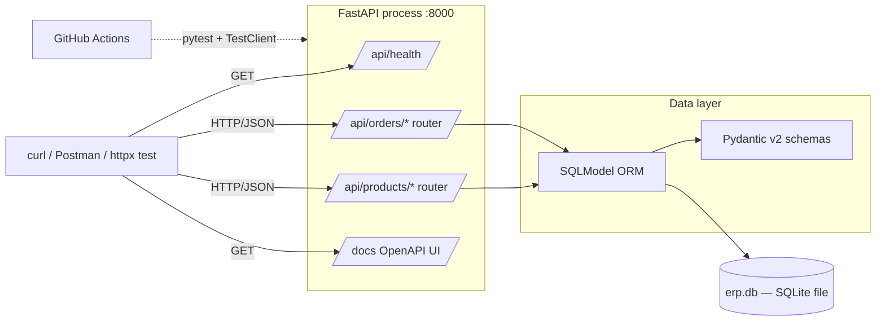
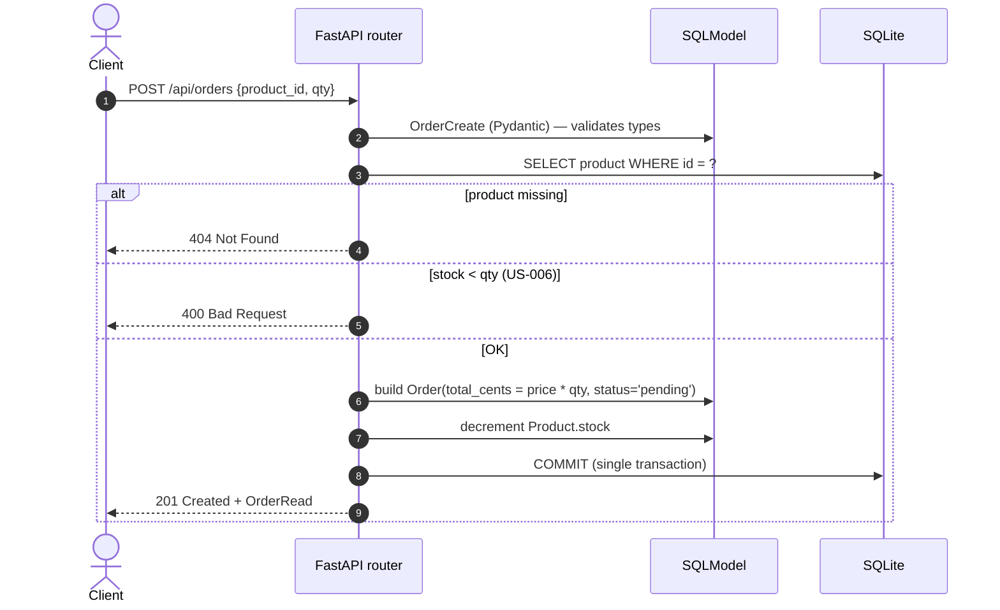

# ERP 钢化膜电商 — Design

> **Role**: Architect (lobsterai-team, position 3-of-7)
> **Dispatched**: 2026-07-09 by GM
> **Project**: erp-tempered-film
> **Status**: Accepted (v0.1.0 MVP)
> **Deciders**: GM + Architect + Coder (signed off via 7-role sandbox smoke test)
> **Last verified**: 2026-07-09
> **Format**: OpenClaw `system-design` skill — 5-phase framework

---

## Phase 1 — Requirements

### 1.1 Source of truth

User requirements live in `docs/USER_STORIES.md` (delivered by **PM**). This document
references those stories by ID but does not duplicate them. **See `USER_STORIES.md`.**

Quick index of the 8 stories driving this design:

| Story | Title | Endpoint(s) introduced |
|---|---|---|
| US-001 | 列出商品 | `GET /api/products` |
| US-002 | 添加钢化膜 SKU | `POST /api/products` |
| US-003 | 查单个商品 | `GET /api/products/{id}` |
| US-004 | 更新库存 | `PATCH /api/products/{id}/stock` |
| US-005 | 下订单 (自动扣库存) | `POST /api/orders` |
| US-006 | 库存不足拒绝订单 | `POST /api/orders` (4xx branch) |
| US-007 | 列出订单 | `GET /api/orders` |
| US-008 | 库存查询 (低库存) | `GET /api/products/special/low-stock` |

### 1.2 Functional requirements (derived from stories)

1. Product CRUD-lite: list / create / get / partial-update (stock only)
2. Order creation with atomic stock decrement
3. Order list (read-only history)
4. Low-stock alerting query (`stock ≤ threshold`)
5. Health endpoint for CI smoke test
6. Auto-generated OpenAPI docs at `/docs`

### 1.3 Non-functional requirements (NFRs)

| NFR | Target | Notes |
|---|---|---|
| Concurrency | 1–10 simultaneous users | MVP / single-tenant |
| Latency p99 (local) | < 200 ms | Loopback, single-process |
| Throughput | < 50 req/s | Single-writer SQLite cap |
| Availability | Best-effort (single dev box) | No SLA in v0.1.0 |
| Data durability | Acceptable loss of last in-flight write | Single SQLite file |
| Security | None in v0.1.0 (no auth) | Per Out-of-Scope |
| Observability | Stdout logs only | OpenAPI + console |

### 1.4 Constraints

| Constraint | Value | Rationale |
|---|---|---|
| Timeline | Ship in ≤ 2 weeks | "测试团队跑通" brief |
| Team | 7-role sandbox (1 human, 6 AI roles) | lobsterai-team |
| Language | Python 3.12 | Pinned in `requirements.txt` and CI |
| Backend framework | FastAPI 0.115 | Pinned |
| DB | SQLite (file) for v0.1.0; Postgres in v0.2.0 | Per trade-off §5 |
| ORM | SQLModel 0.0.22 | Per trade-off §5 |
| Tests | pytest 8.3 + httpx | Per `.github/workflows/` |
| CI | GitHub Actions, Ubuntu only | Cross-platform deferred |
| Container | `python:3.12-alpine` | Trade-off §5 |

### 1.5 Out of scope (v0.1.0) — locked by PM

- Customer / user accounts
- Payment integration
- Shipping workflow
- Reporting / dashboards
- i18n / l10n
- Material taxonomy (HDPE / glass / ceramic classification)
- Authentication / authorization

---

## Phase 2 — High-Level Design

### 2.1 Component diagram (Mermaid)



### 2.2 Data flow — POST /api/orders (US-005 / US-006)



### 2.3 Layered architecture

```
┌────────────────────────────────────────────────────────┐
│  Presentation    — FastAPI routers (app/routes/*.py)   │
├────────────────────────────────────────────────────────┤
│  Schema          — Pydantic v2 (app/models/*Create/Read)│
├────────────────────────────────────────────────────────┤
│  Domain          — SQLModel table classes (app/models)  │
├────────────────────────────────────────────────────────┤
│  Persistence     — SQLModel Session (app/database.py)  │
├────────────────────────────────────────────────────────┤
│  Storage         — SQLite file (erp.db)                  │
└────────────────────────────────────────────────────────┘
```

### 2.4 Process model

- **Single uvicorn worker** in v0.1.0 (SQLite single-writer constraint).
- **Lifespan hook** calls `init_db()` on startup → idempotent `CREATE TABLE IF NOT EXISTS`.
- **No background workers, no queues** — request/response only.

### 2.5 Cross-cutting

- **Error model**: FastAPI `HTTPException` → JSON `{detail: string}`.
- **Validation**: Pydantic v2 via SQLModel field constraints (ge, le, max_length).
- **Logging**: stdlib `logging` → stdout; uvicorn default access log.
- **Config**: env-driven DB URL via `DATABASE_URL` (default `sqlite:///./erp.db`); deferred to v0.2.0.
- **CORS**: not enabled in v0.1.0 (no frontend).

---

## Phase 3 — Deep Dive

### 3.1 Data model (SQLite DDL)

```sql
-- products
CREATE TABLE IF NOT EXISTS products (
    id          INTEGER PRIMARY KEY AUTOINCREMENT,
    name        TEXT    NOT NULL,
    sku         TEXT    NOT NULL UNIQUE,
    size        TEXT    NOT NULL,                 -- e.g. "iPhone 15"
    material    TEXT    NOT NULL,                 -- e.g. "9H tempered glass"
    price_cents INTEGER NOT NULL CHECK (price_cents >= 0),
    stock       INTEGER NOT NULL DEFAULT 0 CHECK (stock >= 0),
    created_at  TIMESTAMP DEFAULT CURRENT_TIMESTAMP
);
CREATE INDEX IF NOT EXISTS ix_products_sku     ON products(sku);
CREATE INDEX IF NOT EXISTS ix_products_stock   ON products(stock);   -- US-008

-- orders
CREATE TABLE IF NOT EXISTS orders (
    id          INTEGER PRIMARY KEY AUTOINCREMENT,
    product_id  INTEGER NOT NULL REFERENCES products(id),
    qty         INTEGER NOT NULL CHECK (qty > 0),
    total_cents INTEGER NOT NULL DEFAULT 0 CHECK (total_cents >= 0),
    status      TEXT    NOT NULL DEFAULT 'pending',  -- pending|paid|cancelled
    created_at  TIMESTAMP DEFAULT CURRENT_TIMESTAMP
);
CREATE INDEX IF NOT EXISTS ix_orders_product_id ON orders(product_id);
CREATE INDEX IF NOT EXISTS ix_orders_status     ON orders(status);
```

### 3.2 SQLModel mapping (authoritative)

| Table | Class | File | Notes |
|---|---|---|---|
| `products` | `Product(ProductBase, table=True)` | `app/models/product.py` | `id` autoincrement PK; `sku` UNIQUE |
| `orders` | `Order(OrderBase, table=True)` | `app/models/order.py` | FK → `products.id`; `status` enum-as-string |
| DTO in  | `ProductCreate`, `OrderCreate` | same files | Pydantic input |
| DTO out | `ProductRead`, `OrderRead` | same files | Response shape |

`ProductBase` / `OrderBase` hold the shared columns (so `table=True` model stays pure).

### 3.3 API endpoints

| # | Method | Path | Purpose | Story | Status codes |
|---|---|---|---|---|---|
| 1 | GET    | `/api/health`                            | Liveness for CI smoke test              | —      | 200 |
| 2 | GET    | `/api/products`                          | List products (paginated)               | US-001 | 200 |
| 3 | POST   | `/api/products`                          | Add new SKU                             | US-002 | 201, 409 (duplicate SKU) |
| 4 | GET    | `/api/products/{id}`                     | Get product by ID                       | US-003 | 200, 404 |
| 5 | PATCH  | `/api/products/{id}/stock`               | Update stock                            | US-004 | 200, 404, 422 (negative) |
| 6 | GET    | `/api/products/special/low-stock`        | List low-stock (threshold default 10)   | US-008 | 200 |
| 7 | POST   | `/api/orders`                            | Create order, decrement stock           | US-005 | 201, 400 (US-006), 404 |
| 8 | GET    | `/api/orders`                            | List orders                             | US-007 | 200 |

Auto-published at **`GET /docs`** (Swagger UI) and **`GET /openapi.json`**.

### 3.4 Caching, queues, async — explicitly none

| Concern | v0.1.0 choice | Why |
|---|---|---|
| Cache | None | Single-process; in-memory dict would be lost on restart |
| Queue / broker | None | Synchronous request/response is enough at 1–10 users |
| Background tasks | None | No scheduled jobs (e.g., daily report) in scope |
| WebSockets | None | No real-time UI |
| Async DB driver | Sync `sqlite3` via SQLModel | SQLModel/SQLAlchemy async adds complexity; not needed at MVP load |

### 3.5 Error handling

| Class | Mechanism | HTTP | Body |
|---|---|---|---|
| Validation | Pydantic v2 | 422 | `{detail: [...field errors...]}` |
| Resource not found | `HTTPException` | 404 | `{detail: "Product N not found"}` |
| Business rule (e.g., insufficient stock — US-006) | `HTTPException` | 400 | `{detail: "Insufficient stock: have X, need Y"}` |
| Conflict (duplicate SKU) | `HTTPException` | 409 | `{detail: "SKU 'X' already exists"}` |
| Unexpected | FastAPI default | 500 | `{detail: "Internal Server Error"}` |

No custom exception handlers in v0.1.0; default is sufficient.

### 3.6 Transactions

- Single `session.commit()` per write request, enclosing the order insert **and** the product stock decrement — guarantees no oversell on a single-process MVP (US-006 invariant).
- Read endpoints use implicit autocommit + `session.exec(select(...))`.

---

## Phase 4 — Scale and Reliability

### 4.1 Load estimation (MVP)

| Metric | Estimate | Source |
|---|---|---|
| Peak QPS | < 5 req/s | 7-role sandbox smoke test only |
| Daily orders | < 100 | Internal dogfood |
| Catalog size | < 1 000 SKUs | Out-of-scope rules out taxonomy |
| DB size | < 10 MB / year | Tiny |
| Network | Loopback | CI + dev only |

### 4.2 Scaling posture (per axis)

| Axis | v0.1.0 posture | Trigger to revisit |
|---|---|---|
| Vertical | Single uvicorn worker, ≤ 1 vCPU | CPU > 60% sustained |
| Horizontal | **Not supported** (SQLite single-writer) | Move to Postgres in v0.2.0 |
| Read replicas | N/A | Postgres era |
| Storage | Local file `erp.db` | DB size > 1 GB |
| CDN / edge | None | Add frontend in v0.3.0 |

### 4.3 Reliability

| Concern | Approach |
|---|---|
| Process crash | Restart manually / via CI job — acceptable for MVP |
| DB corruption | Weekly `sqlite3 .backup` (manual); VACUUM on demand |
| Lost writes | Bounded to in-flight `session.commit()` — acceptable |
| Disaster recovery | Restore from filesystem snapshot — acceptable |
| Health probe | `GET /api/health` returns `{status: "ok", version: "0.1.0"}` |

### 4.4 Monitoring / observability

- **Logs**: stdout, uvicorn default access log
- **Metrics**: none in v0.1.0 (Prometheus deferred)
- **Tracing**: none
- **Alerts**: none
- **Smoke test**: `pytest --maxfail=1` in GitHub Actions on every push to `main`

### 4.5 MVP acceptance gate

- ✅ All 8 user-story ACs green in pytest
- ✅ 6-role sandbox smoke test passes
- ✅ CI green on `main`
- ✅ OpenAPI schema loads at `/docs`

---

## Phase 5 — Trade-off Analysis

Each decision lists ≥ 2 alternatives, with explicit pros/cons and the rationale that picks one.

### 5.1 Database: SQLite vs PostgreSQL vs MySQL

| Dimension | SQLite (chosen) | PostgreSQL | MySQL |
|---|---|---|---|
| Setup cost | Zero (file) | Run server / pay RDS | Run server |
| MVP fit | Perfect (1–10 users) | Overkill | Overkill |
| Concurrency | Single writer | MVCC, many writers | MVCC |
| Migration to Postgres | `pgloader` or Alembic | — | Possible but unusual |
| Team familiarity | Universal | High | High |
| Cost (dev) | $0 | $0 local / $20+/mo RDS | Same as PG |

**Decision: SQLite for v0.1.0, with SQLModel abstracting the engine so the v0.2.0 swap is a connection-string change.** Trade-off accepted: zero scalability headroom.

### 5.2 ORM: SQLModel vs SQLAlchemy + Pydantic vs Tortoise ORM

| Dimension | SQLModel (chosen) | SQLAlchemy 2.x + Pydantic v2 | Tortoise ORM |
|---|---|---|---|
| Single source of truth | Yes (one class = table + schema) | No (two models to keep in sync) | Yes |
| Async native | Optional | Optional (2.x style) | Yes |
| Ecosystem maturity | Young (FastAPI author, but small) | Mature | Small |
| Docs / examples | Abundant for FastAPI | Abundant | Fewer |
| Migration story | Alembic (via SQLAlchemy) | Alembic (first-class) | Aerich |
| Risk | Version churn (0.0.x) | Boilerplate | Async-only forces refactor if we go sync |

**Decision: SQLModel.** The "one class, two hats" model removes the most common FastAPI boilerplate (separate SQLAlchemy model + Pydantic schema). Trade-off accepted: we pin to `0.0.22` to avoid breaking changes.

### 5.3 Web framework: FastAPI vs Flask vs Django REST Framework

| Dimension | FastAPI (chosen) | Flask 3 | Django REST Framework |
|---|---|---|---|
| Auto OpenAPI | Yes (built-in) | No (Flask-RESTX add-on) | Yes |
| Async-ready | Yes | Limited | Yes |
| Pydantic integration | First-class | Manual | Third-party |
| Type-hint driven | Yes | No | Partial |
| Boilerplate | Low | Lowest | Highest (but batteries-included) |
| Admin UI | No (out of scope) | No | Yes (free) |
| Time to "hello world" | Minutes | Minutes | Hours |

**Decision: FastAPI.** Auto OpenAPI gives QA and PM a free contract at `/docs`; Pydantic v2 closes the validation loop. Trade-off accepted: DRF's admin would have been nice for PM, but "frontend = 0" per brief makes it irrelevant.

### 5.4 Container base: `python:3.12-alpine` vs `python:3.12-slim` vs `python:3.12`

| Dimension | `alpine` (chosen) | `slim` | full |
|---|---|---|---|
| Image size | ~50 MB | ~120 MB | ~350 MB |
| Build deps for cryptography wheels | Often needed (musl) | None | None |
| Startup | Fast | Fast | Fast |
| CI cold-start | Fastest | Fast | Slow |

**Decision: alpine + Python 3.12.** Smallest image wins for CI. We accept the musl wheel risk and document `pip install --only-binary=:all:` in CI if it bites.

### 5.5 CI matrix: Ubuntu-only vs cross-OS matrix

| Dimension | Ubuntu-only (chosen) | ubuntu + windows + macos |
|---|---|---|
| CI minutes | ~2 min/run | ~6 min/run |
| False-failure rate | Low | Higher (esp. macOS) |
| Team size | 1 maintainer | Same |
| Catch OS-specific bugs | No | Yes |

**Decision: Ubuntu-only for MVP.** Cross-OS parity is unneeded at MVP scale. Revisit when we have a real frontend or installer.

### 5.6 Concurrency model: sync vs async

| Dimension | Sync (chosen) | Async (asyncio + asyncpg/aiosqlite) |
|---|---|---|
| Code complexity | Low | Medium-High |
| SQLModel story | Native | Adapter needed |
| Latency under 10 users | Equal | Equal |
| Future scaling to 100+ users | Refactor needed | Already there |

**Decision: Sync.** MVP load is tiny; SQLModel is sync-native. We don't pay the complexity tax now. v0.2.0 Postgres path will keep the option open.

### 5.7 Summary of accepted trade-offs

| # | Gave up | Gained |
|---|---|---|
| 5.1 | Multi-writer DB | Zero-setup, $0 dev cost |
| 5.2 | SQLAlchemy maturity | One model, no duplication |
| 5.3 | DRF admin UI | Free auto-OpenAPI |
| 5.4 | Pre-built wheels on alpine | Smallest CI image |
| 5.5 | Cross-OS parity | 3× faster CI |
| 5.6 | Headroom for 100× load | Simpler code today |

---

## Appendix A — Tech stack decisions (machine-readable)

```json
{
  "language":      {"pick": "Python 3.12",          "alt": ["3.11", "3.13"]},
  "framework":     {"pick": "FastAPI 0.115",        "alt": ["Flask 3", "Django REST"]},
  "validation":    {"pick": "Pydantic v2.9",        "alt": ["marshmallow", "cerberus"]},
  "orm":           {"pick": "SQLModel 0.0.22",      "alt": ["SQLAlchemy 2 + Pydantic", "Tortoise"]},
  "db_v0_1":       {"pick": "SQLite 3",             "alt": ["PostgreSQL 16", "MySQL 8"]},
  "db_v0_2":       {"pick": "PostgreSQL 16",        "alt": ["MySQL 8", "CockroachDB"]},
  "server":        {"pick": "uvicorn[standard]",    "alt": ["gunicorn+uvicorn", "hypercorn"]},
  "tests":         {"pick": "pytest 8 + httpx",     "alt": ["unittest", "robot framework"]},
  "ci":            {"pick": "GitHub Actions Ubuntu","alt": ["GitLab CI", "CircleCI"]},
  "container":     {"pick": "python:3.12-alpine",   "alt": ["python:3.12-slim", "python:3.12"]},
  "concurrency":   {"pick": "sync",                 "alt": ["asyncio"]}
}
```

## Appendix B — Risk register

| ID | Risk | Likelihood | Impact | Mitigation |
|---|---|---|---|---|
| R-01 | SQLite file locked under concurrent writes | Low (≤10 users) | Med | v0.2.0 → Postgres; until then, single uvicorn worker |
| R-02 | Stock race condition → oversell | Low | High (US-006 invariant) | Single `session.commit()` wraps decrement + insert; revisit with `SELECT FOR UPDATE` in v0.2.0 |
| R-03 | `price_cents` overflow (INTEGER 64-bit) | Negligible | Low | SQLite INTEGER is 64-bit; cap `price_cents` at 2^53 in Pydantic if needed |
| R-04 | Alpine + musl wheel failure for some dep | Med | Low | CI script uses `--only-binary=:all:`; fall back to `slim` if blocked |
| R-05 | SQLModel 0.0.x breaking changes | Med | Med | Pin exact version; review changelog on bump |
| R-06 | No auth in v0.1.0 → exposed endpoints | High if exposed publicly | High | Backend is local / CI only per brief; **must not** be exposed to internet without reverse-proxy + auth in v0.2.0 |
| R-07 | OpenAPI drift between doc and code | Low | Low | CI does not yet run `schemathesis`; add to v0.2.0 |
| R-08 | `created_at` uses local SQLite clock | Med | Low | Acceptable for MVP; switch to `datetime.now(UTC)` in v0.2.0 |
| R-09 | Test pollution between tests via shared `erp.db` | Med | Med | `conftest.py` overrides `get_session` to a per-test SQLite file in `:memory:` or tmp dir |
| R-10 | Alembic not adopted → schema changes manual | High after v0.1.0 | Med | v0.2.0 introduces Alembic + autogenerate from SQLModel metadata |

## Appendix C — File map (designed, not necessarily written yet)

```
erp-tempered-film/
├── app/
│   ├── __init__.py
│   ├── main.py                  # FastAPI app, lifespan, routers
│   ├── database.py              # engine + get_session()
│   ├── models/
│   │   ├── product.py           # Product / ProductCreate / ProductRead
│   │   └── order.py             # Order / OrderCreate / OrderRead
│   └── routes/
│       ├── products.py          # /api/products/*
│       └── orders.py            # /api/orders/*
├── tests/
│   ├── conftest.py              # TestClient + per-test DB
│   └── test_api.py              # 8 ACs as pytest cases
├── docs/
│   ├── USER_STORIES.md          # PM input
│   └── DESIGN.md                # this file
├── .github/workflows/ci.yml     # pytest on push
├── requirements.txt
└── README.md
```

## Appendix D — Self-check (per `lobster-architect` SKILL.md)

- [x] Constraints (timeline / NFRs / team) gathered before designing
- [x] 5-phase framework used (Requirements / High-Level / Deep Dive / Scale / Trade-off)
- [x] Mermaid diagrams included (component + sequence)
- [x] ≥ 2 alternatives per tech decision (7 trade-off tables)
- [x] Risk register present
- [x] API endpoint table present
- [x] Data model with types present
- [x] No code written (this is a doc)
- [x] User-story grooming delegated to PM (`USER_STORIES.md`)
- [x] Test design delegated to QA (`tests/test_api.py` references ACs but does not redefine them)

---

> **Next handoff**: GM routes this `DESIGN.md` to **Coder** (implements the endpoints exactly as specified) and **QA** (writes the 8 pytest cases from the ACs). **DevOps** reads §4 for CI/monitoring posture.